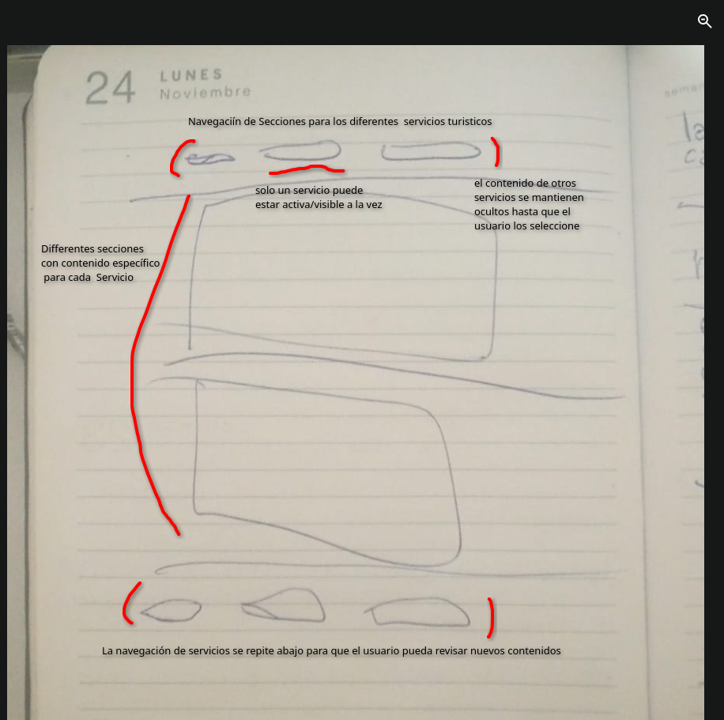

# Proyecto "Casa Cultural Shancayan" (Web)

## Contexto del proyecto
El sitio web es para **Shancayan**, un proyecto de arte comunitario en Áncash centrado en un **circuito turístico con murales** como foco principal.

## Cambios y features solicitados en el sitio

**Contenido / estructura**
- Poner fotos en formato carousel (tanto en galería general como en las fotos con texto)
- Modificar contenidos de las secciones existentes
- Agregar un mapa
- El manifiesto debe bajar de posición — no debe ir primero
- La 2da sección de "Arte comunitario" debe ser un carousel con **todos los proyectos** de Shancayan
- Se deben agregar más secciones para los otros proyectos del cliente
- Sacar las fotos que no se ven bien de la galería
- Ver cómo enlazar la web con **LlamaTrek**

**Navbar / Header**
- Colocar redes sociales en el header
- Incluir número de contacto con logo de WhatsApp
- Incluir links directos a las secciones
- El logo de Shancayan debe resaltar más
- Redes principales de interacción: Facebook, Instagram, TikTok

**Wireframe**

## Pendientes administrativos / logísticos
- [X] Hacer el documento (doc) con todos los contenidos del sitio
- [X] Enviar al cliente los precios de los dominios preferidos
- [X] Volver a evaluar el hosting — el sitio manejará **20+ imágenes**
- [X] El hosting debe ser preferiblemente **anual**
- [X] Una vez pagado el dominio, enviar el QR generado con el link

## Checklist de tareas
- [ ] Cambiar texto del Hero previo al titulo de "Arte comunitario" a "Casa Cultural"
- [ ] El Hero debe ser un carousel de imagenes
- [ ] Cada seccion debe tener un carousel de imagenes
- [ ] Rediseñar/mover el manifiesto (no debe ir primero)
- [ ] Agregar secciones nuevas para otros proyectos
- [ ] Agregar mapa
- [ ] Rediseñar navbar (WhatsApp, redes, links a secciones, logo más visible)
- [ ] Añadir un burger menu en el header para que puedan entrar todas las cosas
- [ ] Depurar galería (quitar fotos feas)
- [ ] Definir enlace/integración con LlamaTrek
- [ ] Pordriamos usar el verde de rednati para el boton de wtsp
